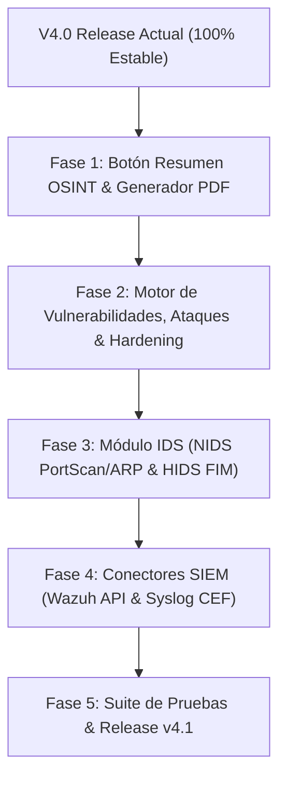

# Plan de Arquitectura e Implementación v4.1: Resumen OSINT, Módulo IDS e Integración SIEM

Este documento detalla el diseño técnico, la arquitectura y el plan de implementación para las capacidades de ciberdefensa avanzada que se incorporarán en **Argos Guard Enterprise v4.1**, abarcando:
1. **Botón de Resumen Táctico de Diagnóstico OSINT y Vulnerabilidades** (Generador de informes PDF de riesgo, ataques explotables y guía de hardening).
2. **Módulo IDS (NIDS / HIDS)** para detección de escaneos de red, suplantación ARP, anomalías y monitoreo de integridad.
3. **Integración con Herramientas SIEM** (Wazuh API REST, Elastic ECS, Syslog CEF/LEEF para Splunk y Sentinel).

---

## 🔍 1. Botón de Resumen Táctico OSINT y Generador de Informes de Riesgo

### 1.1 Diseño de UI/UX (Frontend HTMX / Alpine.js)
- **Ubicación**: En las vistas de inteligencia y diagnóstico (`IntelPanel`), se añade un botón justo debajo de la barra de entrada/botón principal:
  ```html
  <button id="btn-osint-summary" 
          class="btn-cyberpunk-secondary mt-2 w-full"
          hx-post="/api/v1/osint/report/pdf/"
          hx-target="#report-download-container">
      📄 Generar Resumen Táctico de Ciberdefensa (PDF)
  </button>
  ```
- **Comportamiento**: Invoca de forma asíncrona la generación del informe y descarga el archivo PDF directamente en la máquina del cliente sin recargar la página.

### 1.2 Motor de Evaluación de Riesgos y Hardening (`apps/osint/evaluator.py`)
El backend procesará el resultado del análisis OSINT a través de tres capas de inteligencia:
1. **Matriz de Vulnerabilidades (Risk Scoring)**:
   - Análisis de puertos abiertos (FTP 21, SSH 22, RDP 3389, SMB 445, etc.).
   - Auditoría de cabeceras HTTP faltantes (HSTS, CSP, X-Frame-Options).
   - Estado de seguridad DNS (verificación de registros SPF, DMARC, MX).
2. **Modelado de Vectores de Ataque (Explotabilidad)**:
   - Traduce los hallazgos técnicos a escenarios de riesgo comprensibles:
     - *Puertos RDP/SMB expuestos* ➔ *"Vulnerabilidad Crítica: Riesgo de ataques de fuerza bruta o infección por Ransomware"*.
     - *Ausencia de SPF/DMARC en DNS* ➔ *"Riesgo Alto: Susceptible a suplantación de correo (Email Spoofing / Phishing)"*.
3. **Plan Táctico de Remedación (Guía de Hardening)**:
   - Pasos técnicos exactos para mitigar la brecha (ej. comandos de Windows Firewall `netsh`, parches sugeridos y plantillas de registros DNS).

---

## 🛡️ 2. Módulo IDS (Intrusion Detection System)

### 2.1 Motor NIDS (Detección Basada en Red - `apps/security/nids.py`)
- **Detector de Escaneos de Red (Port Scan & Sweep Detector)**:
  - Rastrea la frecuencia de SYN/ICMP recibidos. Si una IP interactúa con más de 10 puertos en menos de 5 segundos, la clasifica como `Scanning Attack`.
- **Detector de ARP Spoofing / Man-In-The-Middle (MITM)**:
  - Inspección periódica de la tabla ARP local (`arp -a`) comparando la MAC de la Puerta de Enlace contra registros históricos para alertar envenenamiento ARP.
- **Detector de Anomalías de Tráfico y DDoS**:
  - Detección de picos inusuales de latencia y ráfagas ICMP/TCP.

### 2.2 Motor HIDS (Detección Basada en Host - `apps/security/hids.py`)
- **Monitoreo de Integridad de Archivos (FIM - File Integrity Monitoring)**:
  - Verificación periódica de hashes SHA-256 sobre archivos críticos (`ArgosGuardV4.exe`, DLLs, `argos_guard_v4.db`).
- **Auditoría de Inicios de Sesión**:
  - Registro de intentos fallidos repetidos en la consola táctica.

### 2.3 Respuesta Activa (IPS Response)
- **Aislamiento Táctico de IP**: Opción para ejecutar bloqueo en Windows Firewall:
  ```powershell
  netsh advfirewall firewall add rule name="ArgosGuard_Block_IP" dir=in action=block remoteip=X.X.X.X
  ```
- **Alertas Omnicanal**: Toasts sonoros/visuales en el Kiosko y notificaciones automáticas a Telegram.

---

## 📊 3. Integración con Herramientas SIEM

### 3.1 Conector Bidireccional Wazuh API REST (`apps/security/wazuh_connector.py`)
- Envío de eventos de Argos Guard a Wazuh Manager en formato JSON/Syslog.
- Consulta de alertas del SOC desde Wazuh API REST para desplegarlas en la pantalla táctica de Argos Guard.

### 3.2 Exportador Elastic SIEM / ECS Format (`apps/core/log_exporter.py`)
- Mapeo de eventos al formato **Elastic Common Schema (ECS)** para ingesta nativa en Elasticsearch / Kibana / Logstash.

### 3.3 Emisor Syslog Estándar (CEF / LEEF)
- Emisión Syslog RFC 5424 (UDP/TCP/TLS) en formato **CEF (Common Event Format)** para integración universal con **Splunk**, **IBM QRadar**, **FortiSIEM** o **Microsoft Sentinel**.

---

## 🗓️ Roadmap de Implementación Sugerido (Versión v4.1)



| Fase | Alcance | Archivos a Modificar / Crear |
|---|---|---|
| **Fase 1** | Botón `📄 Resumen Táctico` y plantilla PDF en OSINT | `apps/osint/views.py`, `templates/osint/` |
| **Fase 2** | Motor de Análisis de Riesgos, Vectores de Ataque y Remedación | `apps/osint/evaluator.py` |
| **Fase 3** | Motor NIDS (Port Scan, ARP Spoofing) y HIDS (File Integrity) | `apps/security/nids.py`, `apps/security/hids.py` |
| **Fase 4** | Integración Wazuh API REST y Emisor Syslog CEF | `apps/security/wazuh_connector.py` |
| **Fase 5** | Suite de Pruebas (`pytest`, `k6`) y Empaquetado v4.1 | Monolito completo |
